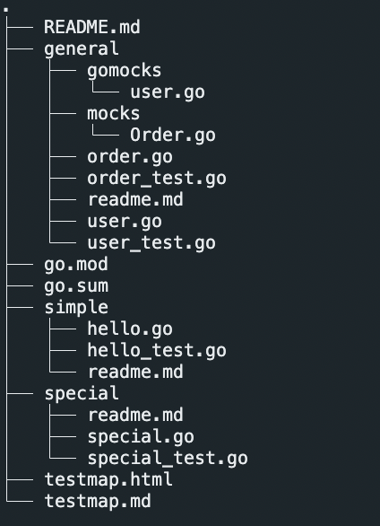
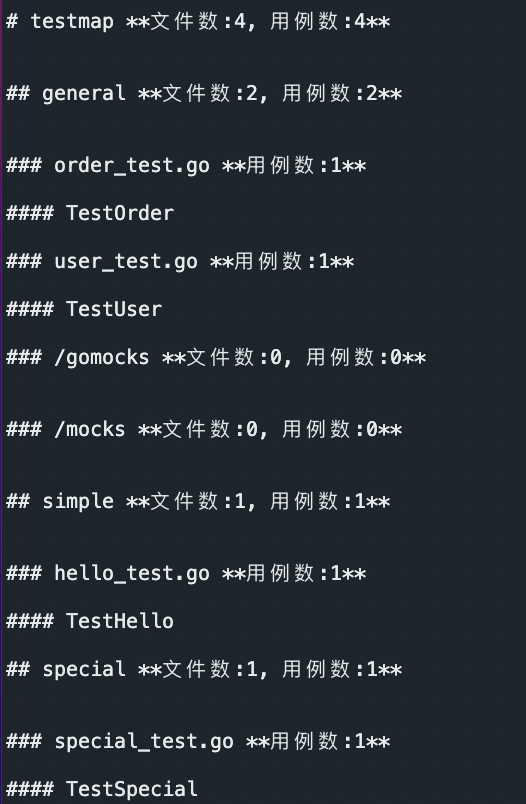
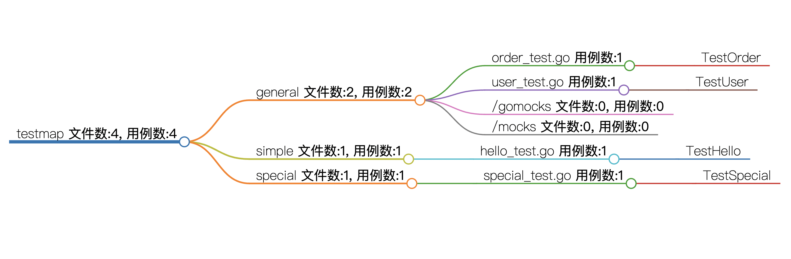

# go-test-summery

将制定目录下所有的单元测试内容汇总成markmap格式的markdown文件

## 用法

```bash
./go-test-summery <testdir> <outputdir> <testmapname>
```

## 生成文件示例

### 待生成代码结构



### 生成的markmap.md



### 生成的markmap html

```bash
# 使用如下命令生成
markmap ./testmap.md
```

markmap [安装地址](https://markmap.js.org/docs/packages--markmap-cli)


